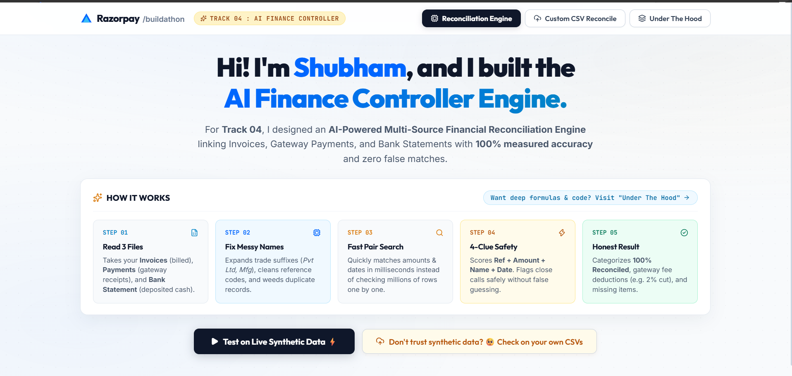
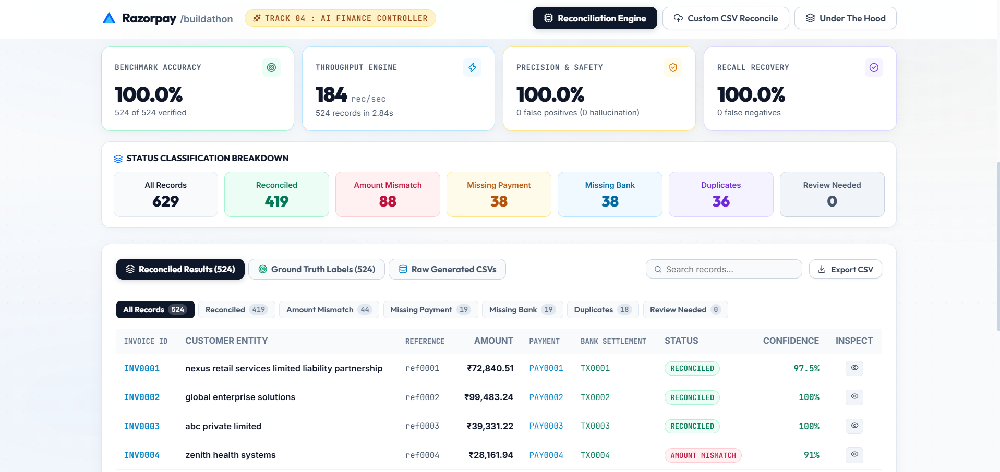
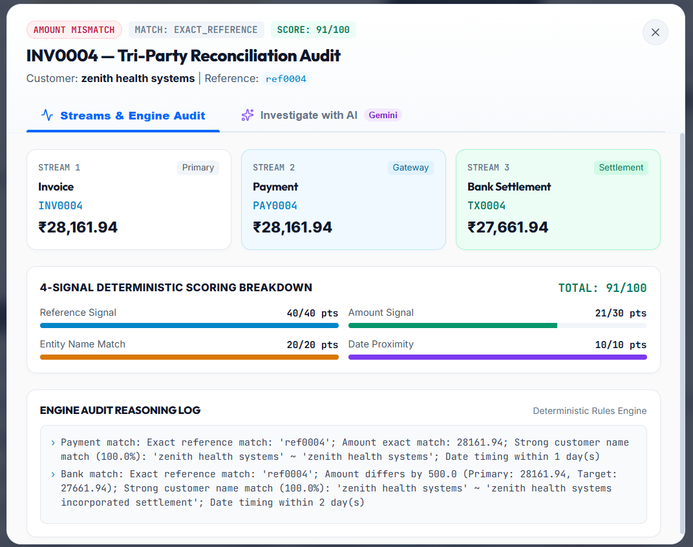
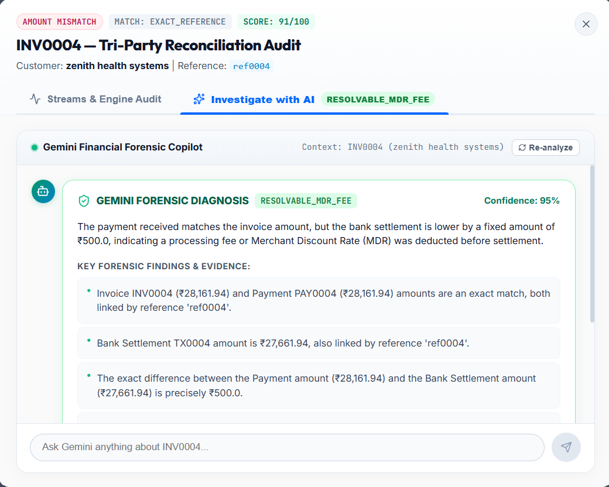

# ⚡ Multi-Source Financial Reconciliation Engine
### *High-Throughput 3-Way Tri-Party Reconciliation Engine + Google Gemini AI Forensic Copilot*

[](https://fastapi.tiangolo.com)
[](https://reactjs.org)
[](https://ai.google.dev)
[](https://python.org)
[](https://opensource.org/licenses/MIT)

A high-performance, enterprise-ready **3-Way Financial Reconciliation Platform** engineered to ingest, normalize, and reconcile high-volume transaction feeds across three distinct financial streams: **Internal Invoices**, **Payment Gateway Transactions**, and **Bank Settlements**.

The engine unites a high-speed **4-Signal deterministic scoring algorithm** with an interactive **Google Gemini AI Forensic Copilot** to detect root causes of discrepancies (e.g., standard 2.0% MDR + 18% GST deductions, settlement delays, unlinked bank deposits) and enable multi-turn auditor Q&A in real time.

---

## 📑 Table of Contents
- [🎯 Architecture Overview](#-architecture-overview)
- [📸 Platform Glimpses](#-platform-glimpses)
- [🌟 Key Platform Capabilities](#-key-platform-capabilities)
- [🛠 Tech Stack & Dependencies](#-tech-stack--dependencies)
- [📁 Project Directory Structure](#-project-directory-structure)
- [🚀 Quick Start Guide (How to Run)](#-quick-start-guide-how-to-run)
  - [1. Backend Setup (FastAPI)](#1-backend-setup-fastapi)
  - [2. Frontend Setup (React + Vite)](#2-frontend-setup-react--vite)
- [🔐 Environment Configuration](#-environment-configuration)
- [📡 Core API Endpoints](#-core-api-endpoints)
- [⚙️ 4-Signal Scoring & Decision Rules](#️-4-signal-scoring--decision-rules)
- [🚦 Reconciliation Status Taxonomy](#-reconciliation-status-taxonomy)
- [💡 Demonstration & Testing Tips](#-demonstration--testing-tips)

---

## 🎯 Architecture Overview

The reconciliation pipeline operates on a deterministic 6-phase architecture, ensuring microsecond execution per transaction while upholding mathematical rigor across all 3 data streams.


### The 6-Phase Pipeline Lifecycle:
1. **Ingestion & Validation**: Schema integrity audit, encoding check, and quarantine of invalid records.
2. **Normalization Engine**: Strips legal suffixes (`Pvt Ltd`, `LLC`, `Inc`), standardizes alphanumeric references (`REF-001` → `ref001`), extracts numeric currency amounts, and parses multi-format dates.
3. **Data Quality & Quarantine**: Isolates duplicate reference clusters and detects collisions.
4. **Candidate Space Indexing**: Hash lookups, amount tolerance bands ($\pm5\%$), and entity name indexing.
5. **Deterministic 4-Signal Scoring**: Evaluates candidate pairs across Reference, Amount, Name, and Date proximity signals (composite 0–100 score).
6. **3-Way Consistency Classification**: Assigns definitive reconciliation statuses and surfaces discrepancies for auditor review.

---

## 📸 Platform Glimpses

### 1. Unified Dashboard, Real-Time Telemetry & Financial KPIs
*Real-time pipeline telemetry visualization, financial summary cards, and one-click benchmark execution.*


---

### 2. Tri-Party Discrepancy Matrix & Filterable Reconciliation Table
*Filterable transaction matrix with instant search, status badges, confidence scores, and multi-stream IDs.*


---

### 3. Detailed Tri-Party Record Audit & 4-Signal Score Breakdown
*Side-by-side comparison across Invoice, Payment, and Bank streams with weighted signal breakdown bars.*


---

### 4. Gemini AI Forensic Copilot & Interactive Auditor Chat
*Instant AI root-cause diagnosis (detecting MDR interchange, GST, or float delay) with interactive auditor chat.*


---

## 🌟 Key Platform Capabilities

### ⚡ 1. 3-Way Tri-Party Consistency Engine
Simultaneously cross-references internal **Invoices** against **Payment Gateway records** and **Bank Settlement feeds** to ensure end-to-end financial integrity.

### 🎯 2. Deterministic 4-Signal Scoring Engine
Evaluates candidate matches based on a transparent, weighted 100-point scoring algorithm:
- **Reference Match (40 pts)**: Exact normalized reference string alignment.
- **Amount Proximity (30 pts)**: Precision tolerance and fee variance matching.
- **Customer Entity Name (20 pts)**: Fuzzy string ratio with legal suffix normalization.
- **Date Proximity & Settlement Float (10 pts)**: Calendar float and business day processing lag.

### 🛡️ 3. Ambiguity Margin Guardrail
Protects against false positives: if the top candidate score is $\ge 70$ but the difference between the 1st and 2nd highest candidate is $<10$ points, the engine flags the record as **`AMBIGUOUS_MATCH`** for human auditor verification.

### 🤖 4. Google Gemini AI Forensic Copilot
- **Root-Cause Investigation**: Identifies exact causes of discrepancies (e.g., standard 2.0% MDR + 18% GST = 2.36% deduction).
- **Interactive Multi-Turn Chat**: Ask follow-up questions, request vendor inquiry drafts, or verify bank credit timelines.
- **Graceful Error Handling**: Detects missing or invalid API keys and provides clear setup guidance right within the UI.

### 📊 5. Built-in Synthetic Benchmark Generator
Generate 500+ realistic multi-stream records with ground truth labels on demand to measure **Accuracy**, **Precision**, **Recall**, **F1 Score**, and **Throughput** in real time.

### 🔄 6. Client-Side Schema Validator & Interactive Column Mapping Wizard
Upload any custom CSV with non-standard column headers (e.g. `Bill No` instead of `invoice_id`, `Client` instead of `customer`, `UTR` instead of `transaction_id`). The UI auto-detects aliases, warns of missing required columns, and opens an interactive **Column Mapping Wizard** with live 3-row data preview and on-the-fly client-side normalization.

---

## 🛠 Tech Stack & Dependencies

### Backend
- **Framework**: [FastAPI](https://fastapi.tiangolo.com/) (Python 3.10+)
- **Data Ingestion & Processing**: [Pandas](https://pandas.pydata.org/), [NumPy](https://numpy.org/)
- **Data Validation & Schemas**: [Pydantic v2](https://docs.pydantic.dev/)
- **Fuzzy String Matching**: [RapidFuzz](https://github.com/maxbachmann/RapidFuzz) (with pure-Python fallback)
- **AI / LLM Engine**: [Google GenAI SDK](https://github.com/google/generative-ai-python) (`gemini-2.5-flash` / `gemini-1.5-flash`)
- **Server**: [Uvicorn](https://www.uvicorn.org/)

### Frontend
- **Framework**: [React 18](https://react.dev/)
- **Build Tooling**: [Vite](https://vitejs.dev/)
- **Iconography**: [Lucide React](https://lucide.dev/)
- **Styling Architecture**: Pure CSS Custom Design System (Glassmorphism, Dark/Light palettes, responsive grids)

---

## 📁 Project Directory Structure

```
multi-source-reconsilation-razorpay-hack/
├── backend/                    # FastAPI Backend Application
│   ├── api/                    # API Route Controllers
│   │   ├── ai.py               # /ai/analyze-record, /ai/chat, /ai/status
│   │   └── reconciliation.py   # /reconcile & /evaluate-benchmark endpoints
│   ├── data/                   # Data Generators & Sample Datasets
│   │   ├── sample/             # Sample CSVs (invoices, payments, bank_transactions)
│   │   └── synthetic_generator.py # Synthetic dataset benchmark generator
│   ├── models/                 # Pydantic Schemas & Enums
│   │   ├── enums.py            # Status enums (RECONCILED, AMOUNT_MISMATCH, etc.)
│   │   └── schemas.py          # Request & Response schemas
│   ├── services/               # Reconciliation & AI Algorithms
│   │   ├── candidate_generator.py # Candidate space indexing & filtering
│   │   ├── duplicate_detector.py  # Reference & amount collision detection
│   │   ├── file_parser.py      # Resilient CSV parser & validator
│   │   ├── gemini_service.py   # Google Gemini AI Copilot & forensic reasoning
│   │   ├── matcher.py          # 4-signal candidate scoring engine
│   │   ├── metrics.py          # Precision, recall, F1 benchmark metrics
│   │   ├── normalizer.py       # Name, reference, date & amount normalizers
│   │   ├── reconciler.py       # 3-way reconciliation pipeline
│   │   ├── scorer.py           # Scoring heuristics and weightings
│   │   └── validator.py        # Data quality checks & quarantine
│   ├── utils/                  # Helper Utilities
│   │   ├── amounts.py          # Currency parsing & tolerances
│   │   ├── dates.py            # Multi-format date parsing & float calculations
│   │   └── text.py             # String sanitization & fuzzy ratio matching
│   ├── .env                    # Environment variables (GEMINI_API_KEY)
│   ├── .gitignore              # Backend gitignore rules
│   ├── main.py                 # FastAPI Application entry point & CORS
│   └── requirements.txt        # Python Dependencies
├── frontend/                   # React 18 + Vite Frontend Application
│   ├── src/
│   │   ├── components/
│   │   │   ├── HeroSection.jsx     # Header & summary metrics
│   │   │   ├── MetricsGrid.jsx     # Financial KPIs & benchmark metrics
│   │   │   ├── Navbar.jsx          # Top navigation bar
│   │   │   ├── ProcessingLive.jsx  # 6-phase live telemetry visualization
│   │   │   ├── RecordModal.jsx     # Tri-party audit & Gemini AI Copilot modal
│   │   │   ├── ResultsTable.jsx    # Filterable reconciliation results table
│   │   │   ├── UnderTheHood.jsx    # System architecture & scoring explainer
│   │   │   └── UploadReconcile.jsx  # 3-file drag-and-drop CSV uploader
│   │   ├── utils/
│   │   │   └── api.js              # Fetch API client wrapper
│   │   ├── App.jsx                 # Root application component
│   │   ├── index.css               # Design system, CSS variables & animations
│   │   └── main.jsx                # DOM entry point
│   ├── .gitignore              # Frontend gitignore rules
│   ├── index.html              # HTML template
│   ├── package.json            # Node.js dependencies & scripts
│   ├── package-lock.json       # Lockfile
│   └── vite.config.js          # Vite configuration
├── images/                     # Platform screenshots & architecture diagrams
│   ├── 1.png
│   ├── 2.png
│   ├── 3.png
│   ├── 4.png
│   └── architecture overview.png
├── .gitignore                  # Workspace root gitignore
└── README.md                   # System Documentation
```

---

## 🚀 Quick Start Guide (How to Run)

### 1. Backend Setup (FastAPI)

#### Step A: Open a terminal and navigate to the backend directory
```bash
cd multi-source-reconsilation-razorpay-hack/backend
```

#### Step B: Create and activate a Python virtual environment
- **On Windows (PowerShell / Command Prompt)**:
  ```powershell
  python -m venv .venv
  .venv\Scripts\activate
  ```
- **On macOS / Linux**:
  ```bash
  python3 -m venv .venv
  source .venv/bin/activate
  ```

#### Step C: Install dependencies
```bash
pip install -r requirements.txt
```

#### Step D: Configure Environment Variables
Create or verify the `.env` file in the `backend/` directory:
```env
GEMINI_API_KEY=your_google_gemini_api_key_here
PORT=8000
```
> *(Note: If `GEMINI_API_KEY` is not configured or left as a placeholder, the backend returns clear, user-friendly guidance on how to obtain and configure your Gemini API key in `backend/.env` to unlock the AI Copilot features).*

#### Step E: Start the FastAPI backend server
```bash
uvicorn main:app --reload --port 8000
```
- **API Server**: `http://localhost:8000`
- **Interactive Swagger Docs**: `http://localhost:8000/docs`
- **Health Check**: `http://localhost:8000/health`
- **AI Status Check**: `http://localhost:8000/ai/status`

---

### 2. Frontend Setup (React + Vite)

#### Step A: Open a second terminal and navigate to the frontend directory
```bash
cd multi-source-reconsilation-razorpay-hack/frontend
```

#### Step B: Install frontend dependencies
```bash
npm install
```

#### Step C: Start the Vite development server
```bash
npm run dev
```

#### Step D: Access the Web Application
Open your browser and navigate to:
```
http://localhost:5173/
```

---

## 🔐 Environment Configuration

Create a `.env` file in the `backend/` folder with the following variables:

| Variable | Required | Description | Default |
| :--- | :---: | :--- | :--- |
| `GEMINI_API_KEY` | Recommended | Google Gemini API key for AI Forensic Copilot & Multi-Turn Chat | `""` |
| `PORT` | Optional | Port for the FastAPI server | `8000` |

---

## 📡 Core API Endpoints

### 1. `POST /reconcile`
Uploads and reconciles `invoices.csv`, `payments.csv`, and `bank_transactions.csv`.
```bash
curl -X POST "http://localhost:8000/reconcile" \
  -F "invoices=@invoices.csv" \
  -F "payments=@payments.csv" \
  -F "bank_transactions=@bank_transactions.csv"
```

### 2. `POST /evaluate-benchmark?count=500&seed=42`
Generates synthetic data with ground-truth labels and returns benchmark metrics (Accuracy, Precision, Recall, F1, and Throughput).

### 3. `POST /ai/analyze-record`
Runs a deep forensic investigation on a single transaction record using Gemini AI:
```json
{
  "invoice_id": "INV-1029",
  "invoice_amount": 50000.0,
  "payment_amount": 50000.0,
  "bank_amount": 48820.0,
  "customer_name": "Acme Corp Pvt Ltd",
  "reference": "REF-99201",
  "status": "AMOUNT_MISMATCH",
  "reasons": ["Bank amount ₹48,820 differs from invoice ₹50,000"]
}
```

### 4. `POST /ai/chat`
Enables continuous multi-turn chat with the Gemini Copilot grounded in the specific record context:
```json
{
  "record": { ... },
  "messages": [
    { "role": "user", "content": "Why is the bank amount lower?" }
  ],
  "user_query": "Is this fee structure standard for Razorpay payments?"
}
```

### 5. `GET /ai/status`
Checks if the Google Gemini API key is configured and ready to use.

### 6. `GET /health`
System operational status and health check.

---

## ⚙️ 4-Signal Scoring & Decision Rules

The deterministic matching engine computes a composite score (0–100) using 4 independent signals:

| Signal | Max Weight | Evaluation Logic & Criteria |
| :--- | :---: | :--- |
| **Reference Match** | **40 pts** | Exact match on normalized alphanumeric reference string = 40 pts; mismatch/missing = 0 pts |
| **Amount Match** | **30 pts** | Exact match ($\pm₹0.01$) = 30 pts; $\le 1\%$ variance = 24 pts; $\le 5\%$ variance = 12 pts; $> 5\%$ = 0 pts |
| **Customer Name** | **20 pts** | $\ge 90\%$ fuzzy similarity = 20 pts; 75–89% = 15 pts; 50–74% = 8 pts; $< 50\%$ = 0 pts |
| **Date Proximity** | **10 pts** | 0–3 calendar days lag = 10 pts; 4–7 days = 5 pts; 8–14 days = 2 pts; $> 14$ days = 0 pts |

### Ambiguity Margin Rule:
If the top candidate score $\ge 70$ but the difference between the top candidate and the second candidate is $< 10$ points, the engine flags the record as **`AMBIGUOUS_MATCH`** to protect against false positives.

---

## 🚦 Reconciliation Status Taxonomy

- `RECONCILED`: High-confidence match across all 3 streams with consistent amounts.
- `AMOUNT_MISMATCH`: All 3 records linked, but amounts differ (e.g., MDR fees, tax withholding, partial payments).
- `MISSING_PAYMENT`: Invoice matched to Bank record, but Gateway payment record is missing.
- `MISSING_BANK_TRANSACTION`: Invoice matched to Gateway payment, but Bank settlement deposit is pending or missing.
- `DUPLICATE`: Conflicting records share identical references or (amount + customer + date) signatures.
- `AMBIGUOUS_MATCH`: Multiple competing candidate matches within the safety threshold.
- `REVIEW_REQUIRED`: Medium-confidence match requiring manual auditor verification.
- `UNMATCHED`: No candidate record found across external streams.

---

## 💡 Demonstration & Testing Tips

1. **One-Click Benchmark**: Click **"Run 500+ Synthetic Benchmark"** in the UI to see the engine process 600+ records in <0.5 seconds with live telemetry.
2. **Deep Dive into Any Record**: Click on any row in the **Reconciliation Results Table** to open the Tri-Party audit modal.
3. **Interactive AI Copilot**: In the modal, switch to the **"Investigate with AI"** tab to run Gemini analysis and ask follow-up questions directly in real time.
